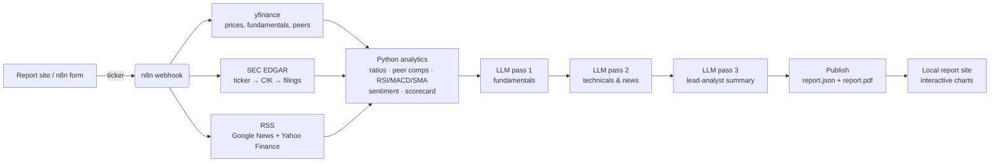

# TickerBrief

**Automated equity research reports: n8n + Python analytics + a local LLM.**

Uploading Automated Stock Research Report Generator Agent Demo.mp4…

Type a ticker, get a full equity research report: price and technicals, fundamentals, peer comparison, SEC filings, news sentiment and an LLM-written narrative, as an interactive web page and a PDF. It runs on your own machine using only free, open-source tools and key-less data sources.

## What it does



| Layer | Tool | Notes |
|---|---|---|
| Orchestration | [n8n](https://n8n.io) (self-hosted, Docker) | Webhook + form trigger, parallel HTTP / RSS nodes, error-tolerant branches |
| Market data | [yfinance](https://github.com/ranaroussi/yfinance) | Prices, statements, analyst targets, industry peers |
| Filings | [SEC EDGAR API](https://www.sec.gov/search-filings/edgar-application-programming-interfaces) | No key; needs a contact User-Agent |
| News | Google News RSS, Yahoo Finance RSS | Deduplicated and scored with VADER plus a finance vocabulary |
| Analytics | Python · FastAPI · pandas | Indicators written in plain pandas, heuristic scorecard |
| LLM | [Ollama](https://ollama.com) (local) | JSON-schema structured output; any chat model (`qwen3:4b` by default) |
| PDF | WeasyPrint + matplotlib | A4 report with charts |
| Site | Static HTML + [Apache ECharts](https://echarts.apache.org) (vendored) | Served by nginx on `localhost:8088` |

Every data branch keeps going if its source fails. If the LLM is unavailable or returns bad JSON, those sections fall back to rule-based text, and the report's **Method** tab shows which fields came from the model and which from rules.

## Quick start

**Requirements:** Docker Desktop, and [Ollama](https://ollama.com) with one chat model pulled (`ollama pull qwen3:4b`).

```bash
git clone https://github.com/KaunteyAcharya/tickerbrief.git && cd tickerbrief
cp .env.example .env        # then edit .env (see below)
docker compose up -d --build
```

<details>
<summary>Windows PowerShell: create <code>.env</code> with a random encryption key</summary>

```powershell
Copy-Item .env.example .env
$b = New-Object byte[] 32; [Security.Cryptography.RandomNumberGenerator]::Create().GetBytes($b)
$key = -join ($b | ForEach-Object { $_.ToString('x2') })
(Get-Content .env) -replace 'replace-with-a-long-random-string', $key | Set-Content .env
notepad .env   # put your email in SEC_USER_AGENT
```
</details>

In `.env` you need to set:
- `N8N_ENCRYPTION_KEY`: any long random string. Generate one with `python -c "import secrets; print(secrets.token_hex(32))"`.
- `SEC_USER_AGENT`: `"YourApp your-email@domain.com"`. SEC EDGAR rejects anonymous requests.
- `LLM_MODEL`: optional. Any model from `ollama list`.

Then open:

| URL | What |
|---|---|
| http://localhost:8088 | **Report site.** Generate reports and browse the library |
| http://localhost:5679/form/research-report | The n8n form, which redirects to the finished report |
| http://localhost:5679 | The n8n editor (create the local owner account on first visit) |

Both workflows are imported and published automatically the first time the stack starts.

### From the command line

```bash
curl -X POST http://localhost:5679/webhook/generate-report \
     -H "Content-Type: application/json" \
     -d '{"ticker": "MSFT", "peers": "AAPL,GOOGL,AMZN"}'
```

Tickers follow Yahoo Finance symbols, for example `MSFT`, `BRK-B`, `INFY.NS`, `RELIANCE.NS`. Indian listings get NIFTY 50 as the benchmark and a curated peer set. SEC filings exist only for US registrants.

## The report

- **Overview:** headline, executive summary, bull and bear case, heuristic scorecard, key stats, 52-week range, analyst targets and returns.
- **Price & technicals:** a zoomable candlestick chart with SMA 20/50/200, Bollinger bands and volume, plus synced RSI and MACD panels, signal checklist and key levels.
- **Fundamentals:** annual revenue, net income and FCF; margin trends; quarterly results; valuation, profitability and balance-sheet tables.
- **Peers:** a switchable metric comparison, 1-year relative performance against the benchmark, and a premium/discount comparison with the peer median.
- **News:** sentiment by day and scored headlines you can filter by tone.
- **Filings:** a timeline of 10-K, 10-Q and 8-K filings with links to EDGAR.
- **Method:** data provenance, LLM coverage and data warnings.

The PDF version has the same sections. A sample is in [`site/samples/`](site/samples/).

## Project layout

```
├── docker-compose.yml          n8n + analytics + nginx (+ optional Ollama profile)
├── .env.example                every setting, with placeholders
├── n8n/
│   ├── workflows/              research-report.json (pipeline) · research-report-form.json (form UI)
│   └── import.sh               first-run import + publish
├── services/analytics/         FastAPI: /market · /analyze · /publish  (+ pytest suite)
├── site/                       static report site (index, report page, ECharts)
│   ├── reports/                your generated reports (git-ignored)
│   └── samples/                committed sample report
├── config/nginx.conf           CSP headers, /api/generate → n8n webhook proxy
└── scripts/sanitize_workflow.py  cleans n8n exports before committing
```

## Configuration

| Variable | Default | Purpose |
|---|---|---|
| `LLM_MODEL` | `qwen3:4b` | Ollama model used for all three passes (`llama3.2:1b` is faster, with weaker prose) |
| `OLLAMA_BASE_URL` | `http://host.docker.internal:11434` | Ollama on the host. To run it in Docker instead, use `docker compose --profile ollama up -d` and set `http://ollama:11434` |
| `LLM_NUM_CTX` | `8192` | Context window passed to Ollama |
| `DEFAULT_BENCHMARK` | `SPY` | Relative-performance benchmark (`^NSEI` is picked automatically for `.NS`/`.BO`) |
| `HISTORY_PERIOD` | `2y` | Price history pulled (charts show the last year) |
| `N8N_PORT` / `SITE_PORT` / `ANALYTICS_PORT` | `5679` / `8088` / `8010` | Host ports, bound to `127.0.0.1` only |

**Using Groq instead of Ollama.** Point the three `LLM:` HTTP nodes at `https://api.groq.com/openai/v1/chat/completions`, add a Header Auth credential in n8n (`Authorization: Bearer <key>`), and switch the body to the OpenAI format with `response_format: {type: "json_object"}`. The key stays in n8n's encrypted credential store and never enters the repo.

## Security

The repo is safe to publish: secrets live only in `.env` and in n8n's encrypted volume, both git-ignored. Workflows carry no credentials, and everything listens on localhost only. gitleaks runs before each commit and in CI. See [SECURITY.md](SECURITY.md) for the details and a pre-push checklist.

## Development

```bash
cd services/analytics
pip install -r requirements.txt pytest httpx
python -m pytest -q
```

If you edit a workflow in n8n, export it (⋯ → Download) and sanitize it before committing:

```bash
python scripts/sanitize_workflow.py ~/Downloads/workflow.json -o n8n/workflows/research-report.json
```

To re-import the bundled workflows (this overwrites your edits in n8n): `docker compose run --rm -e FORCE_IMPORT=1 n8n-import`, then `docker compose restart n8n`.

## Limitations

- yfinance is an unofficial Yahoo Finance scraper. It's fine for personal and educational use, but fields sometimes go missing or change.
- The scorecard is a transparent heuristic, not a model. Small local LLMs can still misread numbers, even though every figure they see is computed upstream.
- **This is not investment advice.** Reports are generated automatically for learning and demonstration.

## License

MIT. Apache ECharts is bundled under the Apache-2.0 license (`site/assets/vendor/ECHARTS-LICENSE.txt`).
